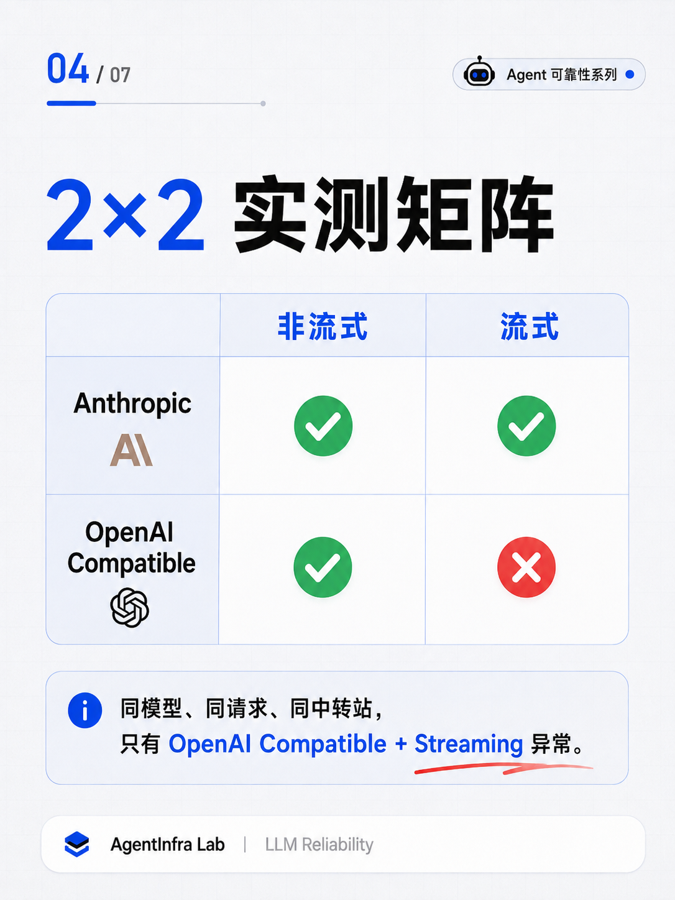

# 01 · Tool Calling Silent Failure

## Problem

The API returned successfully, but the Agent could no longer use tools.

Observed state:

- HTTP 200
- SDK no exception
- `finish_reason = tool_calls`
- actual `tool_calls = 0`

## Test Matrix

| Protocol | Non-Streaming | Streaming |
|---|---|---|
| Anthropic | ✅ | ✅ |
| OpenAI Compatible | ✅ | ❌ |



## Finding

The failure only appeared in the OpenAI-compatible streaming path.

The upstream response declared Tool Calling, but no Tool Call payload was delivered.

## Engineering Defense

If the upstream declares Tool Calling but the actual Tool Call payload is empty:

```text
Hard Fail
