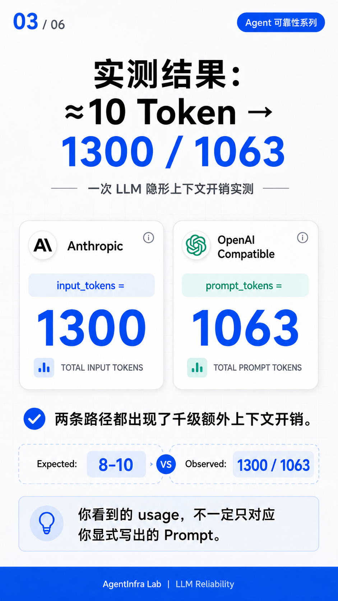

# 02 · Hidden Context Overhead

## Problem

A minimal LLM request produced unexpectedly high input token usage.

The explicit request contained only:

- System: none
- Tools: none
- History: none
- User: `hi`

The explicit request content should only require roughly **8–10 tokens**.

However, the tested endpoint reported:

- Anthropic path: `input_tokens = 1300`
- OpenAI Compatible path: `prompt_tokens = 1063`

This indicates substantial additional input-token overhead beyond the prompt explicitly sent by the client.

---

## Test Conditions

The request was intentionally reduced to the smallest practical input:

```text
System = none
Tools = none
History = none
User = "hi"
```

Expected explicit input:

```text
≈ 8–10 tokens
```

The purpose of this baseline test is to remove obvious sources of token usage such as:

- system prompts
- tool definitions
- conversation history
- long user messages

---

## Observed Usage

| Protocol Path | Reported Input Tokens |
|---|---:|
| Anthropic | 1300 |
| OpenAI Compatible | 1063 |

The explicit request itself was approximately:

```text
≈ 8–10 tokens
```

while the reported usage was:

```text
Anthropic          1300
OpenAI Compatible  1063
```

### Test Visualization



**Key observation:**

Both protocol paths showed roughly thousand-token-scale additional context overhead.

The difference between the two protocol paths was approximately:

```text
237–240 tokens
```

This is not a small accounting deviation.

It suggests that the effective context processed through the two protocol paths may not be identical.

---

## Finding

The test confirms that the usage reported by the endpoint is substantially larger than the prompt explicitly constructed by the client.

A simplified comparison is:

```text
Explicit client input
≈ 8–10 tokens

Observed endpoint usage
≈ 1063–1300 tokens
```

This suggests that the model's effective input context may contain additional content beyond the prompt explicitly sent by the client.

Importantly, the two protocol paths did not report the same amount of input context.

That means:

> The same semantic request routed through different protocol paths may result in different effective context sizes.

---

## Additional Observation

Further testing indicated that the client-provided system prompt behaved more like an **appended instruction** than a complete replacement of the existing upstream context.

A simplified conceptual model may therefore look like:

```text
[Additional / Hidden Context]
[Your System Prompt]
[User Message]
```

rather than:

```text
[Your System Prompt]
[User Message]
```

This does **not** prove the exact internal structure of the upstream implementation.

It only reflects the behavior observed during testing.

---

## Why It Matters

This is not only a token-cost issue.

Additional hidden or upstream-managed context may affect several engineering properties.

### 1. Cost

If every request includes substantial additional input tokens, the real cost floor of the endpoint may be significantly higher than expected.

A request that appears extremely small at the application layer may still consume more than one thousand input tokens.

For high-frequency Agent workloads, this overhead can accumulate quickly.

### 2. Model Behavior

Additional upstream context may influence:

- instruction following
- tool behavior
- response style
- refusal behavior
- reasoning patterns

This means the model may behave differently even when the application-level prompt remains unchanged.

### 3. Reproducibility

The same application code may behave differently when switching:

- protocol paths
- gateways
- relays
- providers
- compatible endpoints

because the effective context may not be identical.

This becomes especially important when debugging Agent behavior across environments.

### 4. Prompt Controllability

Application developers may believe they fully control the prompt while only controlling part of the model's effective context.

This creates a gap between:

```text
Prompt written by the application
```

and:

```text
Context actually processed by the model
```

That gap can make prompt optimization misleading.

You may spend time tuning your own system prompt while an upstream prefix remains unchanged and continues to influence the model.

### 5. Enterprise Auditability

In enterprise environments, hidden context creates additional questions:

- What instructions were actually sent to the model?
- Which layer inserted them?
- Are they stable across requests?
- Do different protocol paths inject different context?
- Can the effective prompt be reproduced during an audit?
- Can the additional context be independently inspected or controlled?

These questions matter for:

- reliability
- governance
- debugging
- security review
- cost analysis
- compliance

---

## Engineering Implication

Do not assume that the prompt written in application code is the full prompt received by the model.

For every LLM endpoint, establish a **minimal input-token baseline** before doing prompt optimization or capability testing.

Recommended baseline:

```text
System = none
Tools = none
History = none
User = "hi"
```

Then record:

```text
input_tokens
```

or:

```text
prompt_tokens
```

depending on the protocol.

A simple engineering check can be expressed as:

```text
Minimal Explicit Input
        ↓
Measure Reported Input Tokens
        ↓
Compare Against Baseline
        ↓
Investigate Unexpected Overhead
```

If a minimal `hi` request consumes `1000+` input tokens, investigate the endpoint or gateway path before assuming that the application prompt is the only context reaching the model.

---

## Recommended Endpoint Baseline Test

A practical smoke test should record at least:

```text
Protocol
Model
Streaming mode
System prompt present?
Tools present?
History present?
User input
Reported input_tokens / prompt_tokens
```

Example:

```text
Protocol: Anthropic
System: none
Tools: none
History: none
User: "hi"
Reported input_tokens: 1300
```

Then repeat the same semantic request across other protocol paths.

This makes it easier to identify:

- fixed context overhead
- protocol-specific differences
- unexpected gateway behavior
- changes after provider upgrades
- baseline cost drift

---

## Suggested Comparison Matrix

For future endpoint testing, a small matrix like this is useful:

| Variable | Test A | Test B |
|---|---|---|
| User input | `hi` | `hi` |
| System prompt | none | none |
| Tools | none | none |
| History | none | none |
| Protocol | Anthropic | OpenAI Compatible |
| Reported input tokens | 1300 | 1063 |

The request semantics remain effectively unchanged while the protocol path changes.

This makes the token difference easier to isolate and investigate.

---

## What This Test Does Not Prove

This test does **not** fully reconstruct the internal prompt sent by the upstream service.

It also does not prove that the entire difference is caused by one system prompt.

Possible upstream contributors may include:

- system instructions
- routing metadata
- provider-specific wrappers
- model-control prefixes
- safety instructions
- compatibility-layer formatting
- other internal context

The current test only confirms the observed usage difference.

The exact internal composition was not reconstructed.

---

## Boundary

This test confirms the presence of substantial additional input-token overhead in the tested endpoint paths.

It does **not** prove:

- the exact contents of the additional context
- the exact internal implementation of the relay or gateway
- that all third-party endpoints behave this way
- that official direct APIs behave the same way
- that every additional token is caused by a single system prompt
- that the additional context is intentionally hidden

The terms:

```text
Hidden Context
Additional Context
Hidden Prefix
```

are descriptive engineering interpretations of the observed behavior.

They should not be treated as a complete reconstruction of the upstream implementation.

---

## Engineering Rule

> The prompt you send is not necessarily the full context the model sees.

Before evaluating model quality, cost, or prompt behavior:

1. establish the minimal input-token baseline
2. compare protocol paths
3. measure the reported usage
4. record the test conditions
5. separate observed facts from implementation assumptions

---

## Practical Checklist

When integrating a new LLM endpoint, check:

- [ ] Minimal `hi` baseline tested
- [ ] System prompt removed for baseline
- [ ] Tools removed for baseline
- [ ] History removed for baseline
- [ ] Input token usage recorded
- [ ] Different protocol paths compared
- [ ] Unexpected token overhead investigated
- [ ] Observed facts separated from inferred causes
- [ ] Results documented for future regression testing

---

## Lesson

> Don't assume what the model sees. Measure it.
