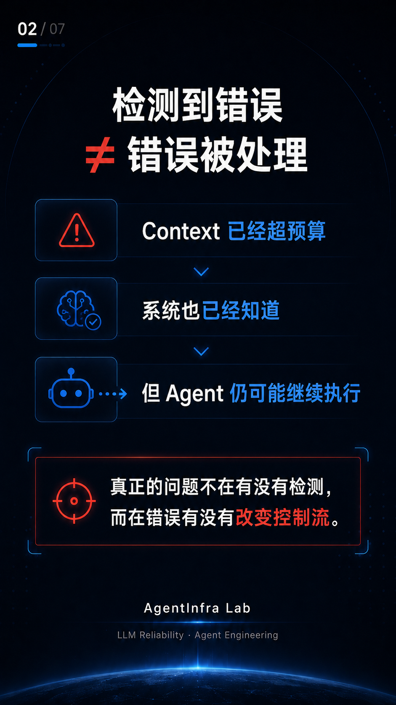

# #03 Context Budget Silent Failure

> When detecting an error is not the same as handling it.

## Problem

An Agent can detect that its context budget has already been exceeded, yet still continue execution if downstream control flow does not actually consume that error state.

This is a subtle reliability failure:

> **Error detected ≠ Error handled**

The system may have observability, status flags, and diagnostics, but if those signals do not change execution behavior, the failure can continue propagating through the pipeline.

---



## Why Context Budget Exists

A production Agent usually sends far more than the user's latest prompt.

The effective context may include:

- System instructions
- Conversation history
- Long-term memory
- Retrieved knowledge / grounding
- Rules
- Tool definitions
- Conflict state
- Other runtime context

A simplified flow looks like this:

```text
User Query
+
History
+
Memory
+
Knowledge
+
Rules
+
Tools
↓
Context Bundle
↓
LLM
```

That is why an Agent needs an explicit Context Budget rather than only checking the visible user prompt.

---

## Expected Control Flow

A typical budget-aware assembly pipeline should behave like this:

```text
Retrieve
↓
Rank
↓
Allocate Context Budget
↓
Reduce / Degrade
↓
Within budget?
├── Yes → Build ContextBundle → Continue
└── No  → Hard Fail → STOP
```

If all degradation strategies have already been applied and the context still cannot fit safely within the configured budget, execution should stop.

---

## Failure Pattern

The dangerous pattern is:

```text
Budget Module
↓
over_budget_error = true
↓
Assembler does not enforce the state
↓
Execution continues
↓
Context keeps being constructed
```

The producer correctly reports an invalid state.

The downstream consumer, however, does not enforce it.

In other words:

> **The system had observability, but not enforcement.**

This is a classic boundary failure between modules.

---

## Why This Matters

Continuing execution after a failed context-budget constraint may cause downstream problems such as:

- Request rejection
- Unexpected truncation
- Degraded model behavior
- Stream interruption
- Hard-to-debug runtime failures

The important point is not that every one of these outcomes must occur.

The reliability issue is that once the system has already determined that the context is outside its allowed operating envelope, continuing execution makes downstream behavior less predictable.

---

## The Fix

The safe behavior is explicit enforcement:

```python
b = budget_mod.allocate(...)

if b.snapshot.get("over_budget_error"):
    raise OverBudgetError(
        "context budget exceeded after all reductions",
        details={
            "budget_tokens": _BUDGET_TOKENS,
            "snapshot": b.snapshot,
        },
    )
```

The key idea is simple:

```text
OVER BUDGET
↓
HARD FAIL
↓
STOP
```

Do not keep trying to “make it work” after the system has already determined that the context is invalid.

---

## Engineering Rule

# Error detection must change control flow.

Detection without enforcement is not reliability.

A useful rule for Agent systems is:

```text
Invalid state
↓
Explicit enforcement
↓
Controlled stop
```

If a component detects a contradiction or an unsafe runtime state, the next question should always be:

> **Did downstream execution actually change?**

---

## Relationship to Case #01 and Case #02

This case belongs to the same reliability series as the previous two cases.

### Case #01 — Tool Calling Silent Failure

The model response indicated a tool-call finish state, but the actual streamed tool-call payload was missing.

```text
Reported state
≠
Actual tool-call data
```

### Case #02 — Hidden Context Overhead

The visible user prompt was tiny, but the effective input context was significantly larger.

```text
Visible Prompt
≠
Effective Context
```

### Case #03 — Context Budget Silent Failure

The budget state indicated that execution should stop, but control flow could continue unless that state was explicitly enforced.

```text
Error State
≠
Actual Control Flow
```

Together, these cases point to a broader engineering lesson:

> Reliability failures often appear at the boundaries between modules, not inside the LLM itself.

---

## Takeaway

When building production Agents, do not only ask:

> “Did the component detect the error?”

Also ask:

> **“Did that error actually change downstream behavior?”**

That distinction is the difference between observability and enforcement.

---

## Principle

> **Don't assume it works. Prove it.**

AgentInfra Lab  
LLM Reliability · Agent Engineering
