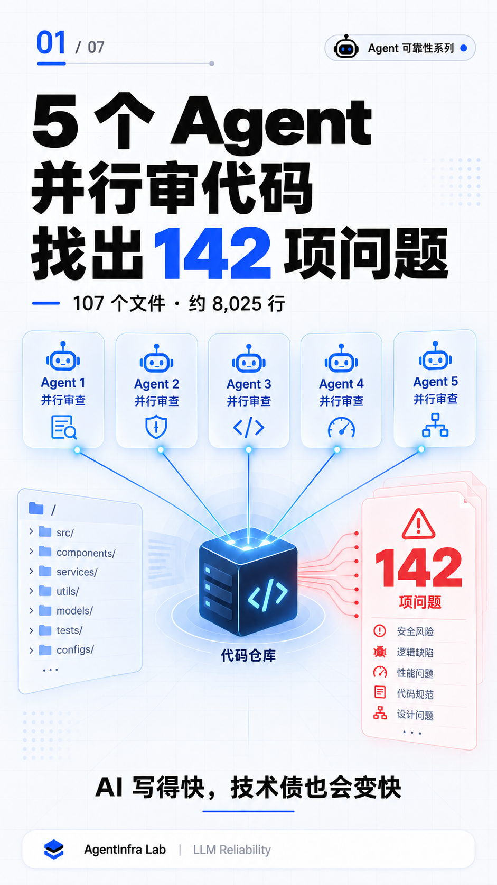

# #05 Multi-Agent Code Review: 142 Findings

> When scaling review coverage is not the same as proving defects.

## Problem

AI can generate code quickly.

It can also generate technical debt quickly.

A single review pass may miss defects that sit across different boundaries:

- Filesystem paths
- Network requests
- Credential handling
- Async client lifecycle
- Database filtering
- Export and streaming behavior

In this case, five Agents reviewed the same backend codebase in parallel.

The review produced **142 findings**.

That number was useful, but it was not the final result.

The central distinction was:

> **Review Output ≠ Verified Defect**

---

## Review Scope

The recorded review covered:

| Item | Recorded scope |
|---|---:|
| Review Agents | 5 |
| Backend files | 107 |
| Backend lines | approximately 8,025 |
| Findings produced | 142 |

The five Agents ran in parallel to expand the review surface.

The historical record does not preserve a reliable role-by-role assignment for those Agents.

This case therefore does not claim that each Agent had a specific security, performance, architecture, or code-quality role.

What the record does support is the use of parallel review to inspect more of the codebase at the same time.

---

## Observed Result

The 142 findings were classified as:

| Severity | Findings |
|---|---:|
| Severe | 24 |
| Medium | 74 |
| Improvement | 44 |
| **Total** | **142** |

This distribution matters.

A raw finding count does not tell an engineer:

- Which issue is reproducible
- Which issue has the greatest impact
- Which findings describe the same root cause
- Which recommendation is safe to apply
- Which change has actually been validated

The discovery count was therefore the beginning of triage, not the end of review.

---

## Why Parallel Review Helps

Different review passes can notice different failure classes.

A path-validation problem may be unrelated to an async resource leak.

An export implementation may be functionally correct on a small fixture while becoming unsafe or inefficient on a full user dataset.

A credential may work correctly while still being exposed through the process list.

Parallel review can widen the search surface:

~~~text
Same codebase
↓
Multiple independent review passes
↓
More candidate findings
↓
Evidence-based triage
~~~

The benefit is coverage.

The cost is that the outputs still require normalization, evidence checks, deduplication, severity assessment, and validation.

---

## Representative Severe Findings

The recorded review included several concrete severe findings.

### 1. Path Traversal Boundary

The code used string-prefix logic to decide whether a resolved path stayed inside an allowed root.

A string prefix is not a filesystem ancestry guarantee.

The fix replaced the prefix test with a path-aware containment check:

~~~python
candidate.is_relative_to(allowed_root)
~~~

The engineering lesson is:

> Filesystem authorization must use filesystem semantics, not string similarity.

### 2. SSRF Defense

The outbound request path needed multiple controls rather than one URL check.

The recorded fix included:

- Scheme allowlisting
- DNS resolution before connection
- Blocking disallowed resolved IP ranges
- Response-size limits
- Manual redirect handling
- Revalidation after each redirect

This matters because a safe-looking URL can redirect or resolve to a destination that the application should not reach.

### 3. Command-Line Credential Exposure

The export path passed a PostgreSQL credential through the command-line arguments used for pg_dump.

Command-line arguments may be visible through process inspection.

The fix moved the credential out of argv and into:

~~~text
PGPASSWORD
~~~

This reduced exposure through commands such as:

~~~text
ps aux
~~~

### 4. Async Client Resource Lifecycle

The review identified an AsyncAnthropic client lifecycle issue that could leak file descriptors or TLS resources.

The fix corrected the client cleanup path rather than relying on process termination to release those resources.

The broader lesson is:

> An async request completing successfully does not prove that the underlying client resources were released.

### 5. Export Data Boundary

The export path could load more user-memory data into the application layer than the export actually needed.

The recorded fix moved user filtering into SQL and combined it with:

- Streaming compression
- Chunked SHA-256 calculation

The boundary changed from:

~~~text
Load broadly
↓
Filter in application code
~~~

to:

~~~text
Filter in SQL
↓
Stream only the required data
~~~

This improved both isolation and resource behavior.

---

## Triage Is the Missing Layer

Multi-Agent review should be treated as a discovery system.

A practical triage pipeline is:

~~~text
Parallel findings
↓
Normalize format
↓
Check evidence
↓
Deduplicate root causes
↓
Assign severity
↓
Fix or track
↓
Run regression validation
~~~

Each finding should contain enough evidence to answer:

1. Where is the relevant code?
2. What input or runtime condition triggers the issue?
3. What behavior was observed or inferred?
4. What is the possible impact?
5. What change addresses the root cause?
6. What validation proves the change did not break the surrounding path?

Without those fields, a finding is a review hypothesis rather than an engineering result.

---

## Remediation Result

The historical review record states:

- **12 severe findings were fixed immediately**
- The changes touched **14 files**
- The remaining **130 findings were registered**

The arithmetic is explicit:

~~~text
142 findings
- 12 fixed
= 130 tracked
~~~

The remaining items were not presented as completed work.

They were kept visible with their evidence, severity, and handling state.

That distinction is important:

> Unfixed work is manageable when it is explicit. Unrecorded work becomes invisible risk.

---

## Why “Fixed” Still Needs Validation

Applying a patch is not the same as completing remediation.

For each accepted fix, validation should cover the boundary that originally made the issue possible.

| Finding | Relevant validation |
|---|---|
| Path traversal | Adversarial sibling paths, encoded paths, symlinks, allowed-root cases |
| SSRF | Private IPs, DNS changes, redirects, oversized responses |
| Credential exposure | Process-list inspection and command failure paths |
| Async client lifecycle | Repeated requests, cancellation, exception paths, resource counts |
| Export filtering | Cross-user fixtures, large exports, streaming and checksum verification |

A code diff can show what changed.

Only validation can show whether the intended boundary now holds.

---

## Engineering Rule

# Multi-Agent review output must enter a verification workflow.

Do not treat the number of findings as the number of confirmed defects.

Do not treat a generated patch as verified remediation.

The safe control flow is:

~~~text
Agent finding
↓
Evidence check
↓
Human / independent review
↓
Fix
↓
Regression validation
↓
Verified or tracked
~~~

Multi-Agent review expands the inspection surface.

Evidence and validation determine what can be accepted.

---

## Relationship to Cases #01–#04

### Case #01 — Tool Calling Silent Failure

~~~text
Reported tool-call state
≠
Actual tool-call payload
~~~

### Case #02 — Hidden Context Overhead

~~~text
Visible prompt
≠
Effective context
~~~

### Case #03 — Context Budget Silent Failure

~~~text
Detected error
≠
Enforced control flow
~~~

### Case #04 — Real Database Type Boundary Failure

~~~text
Visible identifier
≠
Runtime type
~~~

### Case #05 — Multi-Agent Code Review

~~~text
Review finding
≠
Verified defect
~~~

Together, the five cases point to one recurring reliability principle:

> A declared result is not enough. Verify the state that actually crosses the engineering boundary.

---

## Takeaway

Five Agents can inspect more code than one review pass.

They can surface more candidate defects and more possible fixes.

But the system still needs:

- Evidence
- Deduplication
- Severity triage
- Independent judgment
- Regression validation
- A visible technical-debt ledger

The goal is not to maximize the finding count.

The goal is to reduce unverified risk.

---

## Evidence and Limits

This case is based on the recorded engineering review of the NeverReset V1.0 backend.

The historical record supports:

- 5 parallel review Agents
- 107 backend files
- approximately 8,025 backend lines
- 142 findings: 24 severe, 74 medium, and 44 improvement
- 12 severe findings fixed immediately across 14 files
- 130 remaining findings registered
- the representative remediation examples described above

Scope limits:

- The review was not rerun for this publication.
- The 142 items are review findings, not a claim of 142 independently confirmed vulnerabilities.
- The record does not establish a precise role assignment for each of the five Agents.
- No false-positive rate was recorded, so this case does not invent one.
- The examples are simplified technical descriptions and do not expose private repository contents, credentials, customer data, or production infrastructure.

---

## Principle

> **Let Agents widen the search. Let evidence decide what ships.**

AgentInfra Lab  
LLM Reliability · Agent Engineering
