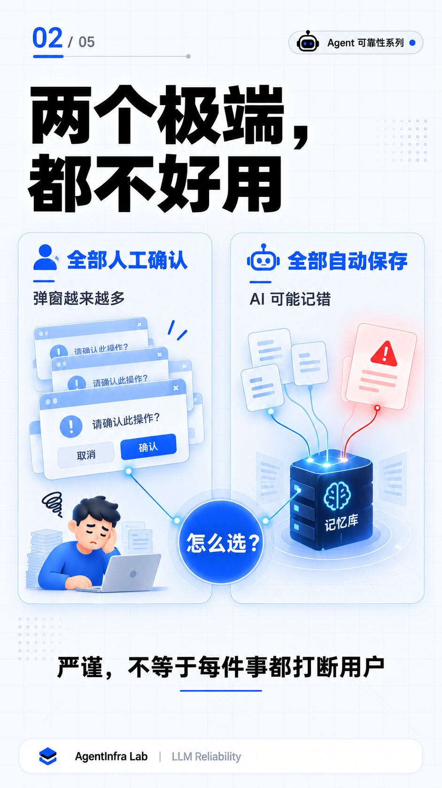

# \#06 AI Memory Confirmation Overload

> When a memory feature creates more work for the user.

## Problem

Long-term memory sounds simple:

1. Extract useful information from a conversation.
2. Save it.
3. Reuse it later.

The difficult part is deciding **when the system may save information automatically and when it should ask the user**.

If every memory requires confirmation, the product creates a growing review queue. If every memory is accepted automatically, an AI inference may be stored as if the user had confirmed it.

The design problem is therefore not how to store more information. It is how to reduce interruptions without losing provenance, uncertainty, and user control.

\---

## Two Simple Policies, Two Different Failures

### Policy A: Confirm Everything

A strict design can show a confirmation card whenever the system extracts a possible memory:

* Save this preference?
* Update this project fact?
* Accept this conclusion?
* Replace the previous information?

This looks careful, but it moves the system's classification work to the user. As conversations accumulate, the number of confirmation decisions can also accumulate.

The memory feature then becomes an inbox that the user must maintain.

### Policy B: Save Everything Automatically

The opposite design removes interruptions, but it removes an important distinction as well:

\~\~\~text
What the user explicitly said
≠
What the model inferred
\~\~\~

A model-generated interpretation may be useful, but it does not have the same authority as a direct user statement. Saving both in the same way makes later context harder to trust.

\---

## Classify Before Asking

The NeverReset memory design uses different handling rules for different information types.

|Information type|Example|Default handling|
|-|-|-|
|Explicit preference or stable fact|"Use Chinese by default."|Save automatically|
|Model-derived inference|"The user may prefer speed."|Save with source and review state|
|Important project conclusion|"The project direction has changed."|Handle cautiously; confirmation may be required|

The examples above are illustrative. The rule is based on where the information came from and how much damage an incorrect memory could cause.

For a model-derived conclusion, the record should preserve at least:

* The source evidence
* Whether it was created by the user or the model
* Whether the user reviewed it
* Its current status

This allows the system to reuse an inference without presenting it as a confirmed fact.

\---

## Not Every Conflict Means the Same Thing

New information can disagree with an existing memory. The correct response depends on the type of conflict.

### Factual update

Some changes represent a newer fact replacing an older fact. For example, a project may move from one database to another.

In that case, the new fact can become current while the old record remains in history with a superseded or expired state.

### Conclusion conflict

Other changes express competing judgments:

\~\~\~text
Old conclusion: prioritize development speed
New conclusion: prioritize system stability
\~\~\~

The system should not silently decide which judgment is correct. It should preserve both conclusions, mark the conflict, and request a decision when that decision becomes relevant.

This keeps the history visible and prevents the latest model output from quietly rewriting an earlier decision.

\---

## Confirmation Should Be Proportional

The confirmation cost should follow the confidence and impact of the memory.

|Memory state|Interaction|
|-|-|
|Clear, low-risk information|Save without interruption|
|Model inference with traceable evidence|Save with provenance and an unreviewed state|
|Important conclusion in a strict project|Show a focused confirmation card|
|Conflicting conclusions|Keep both and ask when the conflict matters|

Confirmation can also be summarized or batched instead of interrupting the current task. A project that requires stronger control can opt into a stricter confirmation mode.

The user should spend attention on decisions that require judgment, not on approving every extracted sentence.

\---

## Engineering Rule

> \*\*The confidence and impact of a memory determine its confirmation cost.\*\*

A practical control flow is:

\~\~\~text
Extract candidate information
↓
Identify its source and type
↓
Estimate confidence and impact
↓
Save, mark for review, or request confirmation
↓
Preserve later updates and conflicts
\~\~\~

\---

## Why This Matters for Agent Systems

An Agent may act on remembered information without asking the user to repeat it. That makes memory useful, but it also increases the cost of a wrong memory.

A reliable memory system needs to answer four questions:

1. Who created this information?
2. What evidence supports it?
3. Has the user reviewed it?
4. What happened when newer information disagreed with it?

Without those answers, a stored sentence may look authoritative even when it began as a model guess.

\---

## Relationship to Cases #01–#05

### Case #01 — Tool Calling Silent Failure

\~\~\~text
Reported tool-call state
≠
Actual tool-call payload
\~\~\~

### Case #02 — Hidden Context Overhead

\~\~\~text
Visible prompt
≠
Effective context
\~\~\~

### Case #03 — Context Budget Silent Failure

\~\~\~text
Detected error
≠
Enforced control flow
\~\~\~

### Case #04 — Real Database Type Boundary Failure

\~\~\~text
Visible identifier
≠
Runtime type
\~\~\~

### Case #05 — Multi-Agent Code Review

\~\~\~text
Review finding
≠
Verified defect
\~\~\~

### Case #06 — AI Memory Confirmation Overload

\~\~\~text
Stored information
≠
User-confirmed fact
\~\~\~

The recurring reliability question is the same: what does the system actually know, and what has only been inferred or declared?

\---

## Takeaway

A useful memory system should remember the right information at the right time while asking the user for as little unnecessary work as possible.

The operating rules are simple:

* Save clear facts with minimal interruption.
* Keep the source of model inferences.
* Treat important conclusions cautiously.
* Preserve conflicting conclusions until the user decides.

The goal is not to maximize the number of stored memories.

The goal is to make future Agent behavior easier to trust.

\---

## Evidence and Limits

This case is based on the recorded design evolution of the NeverReset V1.0 memory system.

The historical engineering record supports:

* Separate handling for explicit facts, model-derived conclusions, and important project conclusions
* Provenance and review-state tracking for model-created memories
* Optional stricter confirmation behavior at the project level
* Different handling for factual updates and conflicting conclusions
* Preservation of competing conclusions while a conflict is pending
* Reduced-interruption patterns such as summarized or batched review

Scope limits:

* This case describes an engineering design problem and its recorded control rules; it does not claim a measured production incident.
* No user study or quantified confirmation-abandonment rate is available.
* The sentences shown in the diagrams are explanatory examples, not private user data.
* This case does not claim that every conflict requires manual resolution. Straightforward factual updates and conflicting conclusions follow different rules.

\---

## Principle

> \*\*Remember correctly. Ask only when judgment is required.\*\*

AgentInfra Lab  
LLM Reliability · Agent Engineering

